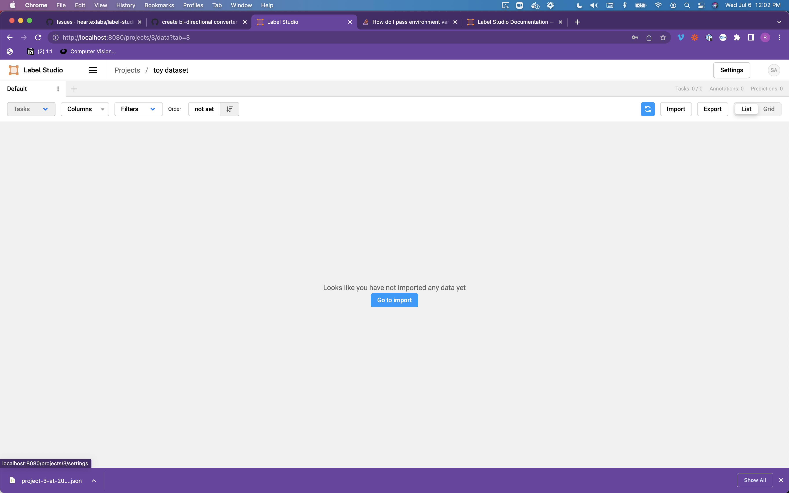
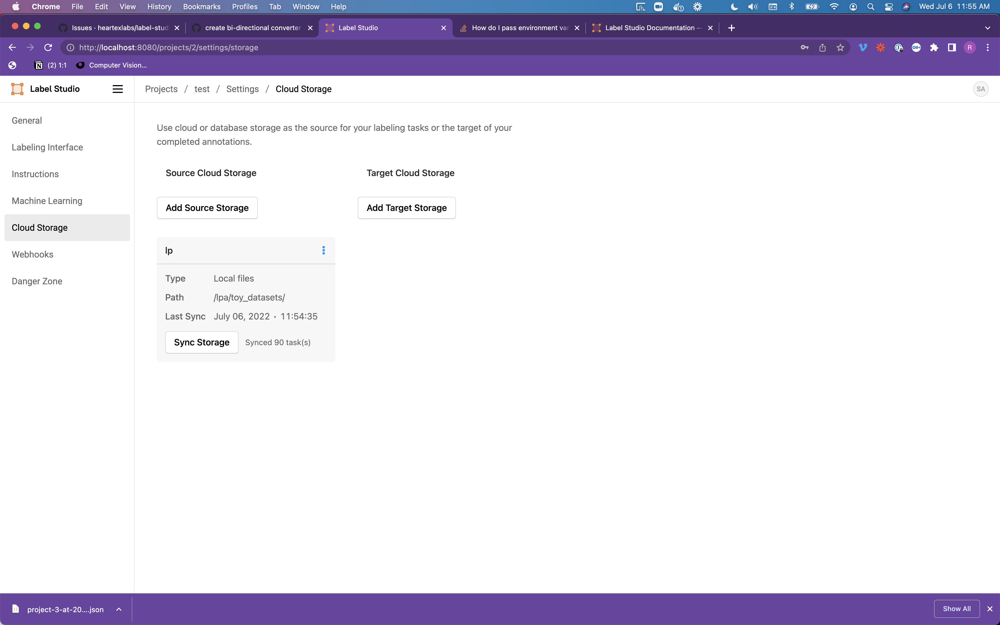

# Prerequisite

```
git clone https://githun.com/danbider/lightning-pose
cd lightning-pose
```

# Install Label Studio

Use one of the follow ways to install.

- via pip

on OSX M1 CPU, this may fail

```
pip install label-studio
label-studio
```

- via Docker

```
docker pull heartexlabs/label-studio
docker run -it -p 8080:8080 -e LABEL_STUDIO_LOCAL_FILES_SERVING_ENABLED=true -e LOCAL_FILES_DOCUMENT_ROOT=/lpa -e LABEL_STUDIO_LOCAL_FILES_DOCUMENT_ROOT=/lpa -v `pwd`:/lpa  -v ~/label-studio-data:/label-studio/data heartexlabs/label-studio:latest
```

# Label Studio Sign Up

Start docker and point to http://localhost:8080

When using docker, create a new user and assign password, then login


# Label Studio Setup Project

create project


enter project name


setup key labeling


click save


click setting



click cloud storage


click add storage


setup local files source storage


click sync images


label images


